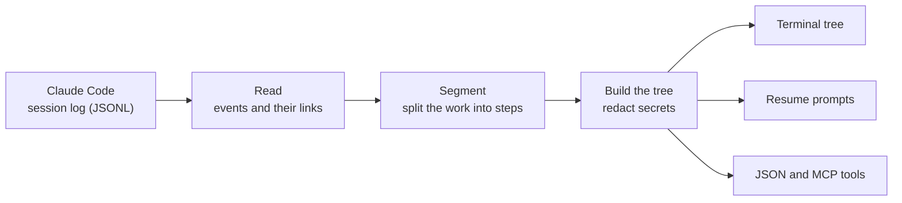

<div align="center">

# agent-tree

**Navigate Claude Code and Codex sessions as numbered trees — and pick up from any point.**

[](https://www.npmjs.com/package/@seungwoolee/agent-tree)
[](https://github.com/lifrary/agent-tree/actions/workflows/ci.yml)
[](https://github.com/lifrary/agent-tree/commits/main)
[](./LICENSE)

<br>


<sub>Row 1 is the session itself. Under it sits every prompt you typed and the work it triggered, with the time since the session began and its place in the log. ⭐ marks steps you resumed from.</sub>

</div>

<br>

A long Claude Code session is hard to look back on. Somewhere in hundreds of messages is the moment right before things went sideways, and scrolling the transcript won't find it for you.

**agent-tree** reads the session logs Claude Code and Codex already keep and turns them into numbered outlines: every prompt you typed, with the reads, edits and commands it triggered underneath. Every numbered row is a step. Pick one and you get a ready-to-paste prompt that carries on from that moment in a fresh session — or tries it another way.

<table>
<tr>
<td width="33%" valign="top">

**🗺️ See the whole session**

Every prompt you typed becomes a numbered step, with the work it triggered nested underneath.

</td>
<td width="33%" valign="top">

**↩️ Jump back in**

Get a resume prompt for any step. Carry on from there, or fork and try another way.

</td>
<td width="33%" valign="top">

**⭐ Star the turning points**

Steps you resume from are starred, so the moments that mattered stand out next time.

</td>
</tr>
<tr>
<td valign="top">

**🧩 Works inside Claude Code**

Install the plugin and Claude can browse and resume sessions for you through MCP, the protocol Claude Code uses for tools.

</td>
<td valign="top">

**📦 Scriptable**

Export a session's tree as JSON for dashboards, reports and your own tools.

</td>
<td valign="top">

**🔒 Redacted output**

API keys, tokens and card numbers are stripped before anything is shown, copied or exported.

</td>
</tr>
</table>

## Install

```bash
npm install -g @seungwoolee/agent-tree
```

The published 0.1.x release needs Node.js 20 or later. Source builds need Node.js 22.13 or later and include [Codex support](#codex-sessions). Until the next npm release, install from source. `dist/` is committed, so there is no build step:

```bash
git clone https://github.com/lifrary/agent-tree
cd agent-tree
npm install -g .
```

This links the `agent-tree` and `atree` commands to your clone, so a `git pull` keeps you current. `main` needs Node.js 22.13 or later. For the optional AI-written step labels, also run `npm install` inside the clone; it adds the Anthropic SDK.

To use it from inside Claude Code, install [the plugin](#use-it-inside-claude-code).

## Quick start

```bash
cd ~/Code/your-project
agent-tree
```

That opens the project's most recent session as an interactive tree. Type a step's number (`7`) to copy a prompt that carries on from it, `7 fork` for one that tries it another way, or `q` to quit. Then start a new `claude` session and paste.

A few more commands:

```bash
agent-tree --list                      # print the tree, for pipes and scripts
agent-tree --list --phases-only        # only the prompts you typed
agent-tree --list --filter redis       # only the steps that match a keyword
agent-tree --snapshot 7 --mode fork    # print one resume prompt
agent-tree --diff 7 12                 # what happened between two steps
agent-tree --picks                     # every starred step, across sessions
agent-tree 3f9c2a71 --list             # a specific session, by ID prefix
```

If `ANTHROPIC_API_KEY` is set, agent-tree also asks Claude for short step labels, which bills your Anthropic account. Add `--no-llm` to skip that. `agent-tree --help` lists every option.

## Codex sessions

Discovery defaults to Claude Code. Select Codex explicitly, or import a file
and let agent-tree detect its format:

```bash
agent-tree --source codex --sessions --limit 10
agent-tree --source codex --cwd ~/Code/api --no-llm --list
agent-tree --source codex 3f9c2a71 --no-llm --snapshot 7 --mode fork
agent-tree --file ./rollout.jsonl --no-llm --strict --json
agent-tree --source codex --picks
```

Codex discovery reads metadata headers from
`<CODEX_HOME or ~/.codex>/sessions/YYYY/MM/DD/rollout-<timestamp>-<uuid>.jsonl`.
It excludes subagent sessions and symlinks; explicit `--file` can inspect a
subagent export. `--cwd` matches the working directory recorded in the header.
Archived sessions are not scanned; open those with `--file`.

Messages, tool calls/results, patch file paths, and public reasoning summaries
are normalized into the same analysis pipeline as Claude logs. Duplicate
`event_msg` message notifications are not counted again. Compaction summaries
are retained as system events; replacement history is not replayed. Encrypted
reasoning is not decoded. A rollout is a chronological log, not a reconstructed
cross-session fork tree.

Continue/fork output is a **copy-paste context prompt**, not a native
`codex resume`/`codex fork` operation, and does not restore files. Claude and
Codex stars are isolated under
`~/.cache/agent-tree/picks/<source>/<session-id>.jsonl`. Old flat-directory
star history is not read or migrated.

JSON mindmaps and catalog entries identify their `source`.
All MCP tools accept optional `source: "claude" | "codex"`. Omit it for
Claude discovery or automatic file detection; `agent_tree_picks({})` lists
both sources. An explicitly selected source that disagrees with a recognized
file header is rejected. For unknown/headerless exports, specify the source.

## What's new in 0.2

The 0.2.1 preparation work (October 2026) is included in the current source
alongside Codex support. npm publication is still pending;
[install from source](#install) to use it today.

- **Browse sessions across projects.** `agent-tree --sessions` lists your recent sessions instantly, without opening them. Claude gets the same view through the new `agent_tree_sessions` tool.
- **Open any session file.** `--file` reads a session log from anywhere, such as one a teammate exported, and `--cwd` points at another project without changing directory.
- **JSON for your own tools.** `--json` prints the complete, redacted tree, and `--strict` stops at malformed input instead of skipping it.
- **Layered configuration.** Defaults, then `~/.config/agent-tree/config.yaml`, a per-project `.agent-tree.yaml`, environment variables, and finally flags.
- **Ready for current Claude Code logs.** Reads the newest transcript format cleanly, with CI on Linux and macOS for Node 22, 24 and 26.
- **Native TypeScript 7 checks.** Development uses the native compiler while
  retaining TypeScript 6 for the lint toolchain's compiler API. CI verifies
  release versions, committed bundles, and a fresh tarball's CLI and MCP server.

```bash
agent-tree --sessions --limit 10           # recent sessions, all projects
agent-tree --cwd ~/Code/api --list         # another project's latest session
agent-tree --file ./session.jsonl --list   # a session file from anywhere
agent-tree --json > session.json           # the whole tree as JSON
```

0.2 also raises the minimum Node.js version to 22.13. The [changelog](./CHANGELOG.md) covers every change.

## Resume from any point

Every step comes with two resume prompts.

| Mode         | Use it when                                                |
| ------------ | ---------------------------------------------------------- |
| **continue** | Everything up to here was right. Carry on from this point. |
| **fork**     | This is where it went wrong. Try another way from here.    |

A resume prompt is plain markdown: where it came from, the files involved and your last instruction at that point, plus the repository's current branch, recent commits and status when you run it inside a git repository. In a terminal it lands on your clipboard; paste it as the first message of a new `claude` session.

```console
$ agent-tree 3f9c2a71 --snapshot 7 --mode fork
# Forking at: "Store sessions in Redis instead of memory" (discarding future)

**Source session**: `3f9c2a71-5b8e-4d02-9a64-1c7e0b2d8f45` (events 14–19)
**Mode**: fork (discarding subsequent turns from original session)
…
## What I want you to DO
- Ignore whatever path the original session took after this.
- Re-approach the open question fresh.
- You may suggest different architecture / file layout / tools.
…
```

Resuming from a step stars it ⭐ (the CLI calls these picks). `--picks` lists them all and `--unstar 7` removes one.

## Use it inside Claude Code

The plugin gives Claude six tools for browsing and resuming sessions, so you can simply ask:

> _"List my recent sessions in this project."_<br>
> _"Show the last session here as a tree, prompts only."_<br>
> _"Give me a fork prompt from step 7."_

```bash
claude plugin marketplace add lifrary/agent-tree
claude plugin install agent-tree@agent-tree
```

Restart Claude Code afterwards; `/mcp` should then list `agent-tree` as connected. The plugin installs from this repository, so it runs the latest code on `main`.

| Tool                  | What it does                                                   |
| --------------------- | -------------------------------------------------------------- |
| `agent_tree_sessions` | Lists recent sessions, optionally for one project (new in 0.2) |
| `agent_tree_list`     | Shows a session as a numbered tree, as text or JSON            |
| `agent_tree_snapshot` | Writes a continue or fork prompt for one step and stars it     |
| `agent_tree_diff`     | Summarizes what happened between two steps                     |
| `agent_tree_picks`    | Lists every starred step across sessions                       |
| `agent_tree_unstar`   | Removes a star                                                 |

<details>
<summary><b>Updating the plugin</b></summary>

<br>

The plugin follows `main`, so updating it pulls in the latest code:

```bash
claude plugin marketplace update agent-tree
claude plugin update agent-tree@agent-tree
```

`claude plugin update` acts only when the version number changes. To take newer commits that share a version, reinstall after the marketplace update:

```bash
claude plugin uninstall agent-tree@agent-tree
claude plugin install agent-tree@agent-tree
```

Restart Claude Code either way.

</details>

<details>
<summary><b>Installing from a local clone, and troubleshooting</b></summary>

<br>

To develop against your own checkout, register it instead of GitHub. From inside the clone:

```bash
claude plugin marketplace add "$PWD"
claude plugin install agent-tree@agent-tree
```

A local marketplace remembers the absolute path it was added with, so run `claude plugin marketplace add` again after moving or renaming the folder.

If the tools don't show up:

1. `claude plugin list | grep -A3 agent-tree` should include `Status: ✔ enabled`.
2. `ls ~/.claude/plugins/cache/agent-tree/agent-tree/*/dist/mcp-server.js` should find the server.
3. Restart Claude Code; MCP servers only start with a new session.
4. Claude Code does not scan `~/.claude/plugins/local/`, so copying the repository there does nothing. Use the commands above.

</details>

## How it works



1. **Read.** Claude Code writes every session to a JSONL log under `~/.claude/projects/`. agent-tree streams that log and rebuilds the order of events from their parent links.
2. **Segment.** The work under each prompt is split into steps at six kinds of boundaries: pauses, a change of files, topic-shift phrases, slash commands, switches into or out of subagents, and a cap on turns per step.
3. **Build.** Each prompt you typed becomes a top-level step, with the steps it triggered nested underneath and labeled by the file and tool involved. Secrets are redacted here, before anything is printed, copied or exported.
4. **Output.** The same tree feeds the terminal view, the resume prompts, JSON export and the MCP tools.

## Privacy

- agent-tree runs on your machine and reads only the session logs that are already there.
- Everything it prints, copies or exports is redacted first: API keys and tokens for Anthropic, OpenAI, GitHub, Slack, AWS, Google Cloud, Stripe, Hugging Face and npm, plus bearer tokens, JWTs, private keys and card numbers. `--redact-strict` also removes email addresses, phone numbers, US SSNs and Korean RRNs.
- The one network call is the optional LLM labeling, made only when `ANTHROPIC_API_KEY` is set. `--no-llm` turns it off, and the MCP tools never use it.
- Redaction is pattern-based, so read a resume prompt before you share it outside.

## Reference

<details>
<summary><b>Command-line options</b></summary>

<br>

| Option                                                                | Default             | Notes                                                                          |
| --------------------------------------------------------------------- | ------------------- | ------------------------------------------------------------------------------ |
| `<session-id>`                                                        | smart default       | UUID or prefix (4+ characters; 8+ is safer)                                    |
| `--latest`                                                            | —                   | the most recent session across all projects                                    |
| `--pick`                                                              | —                   | choose from recent sessions interactively                                      |
| `--file <path>`                                                       | —                   | read a Claude Code or Codex JSONL file; auto-detect its source                  |
| `--source <claude\|codex>`                                            | Claude discovery; automatic file detection | select the session source                              |
| `--cwd <dir>`                                                         | current directory   | project for discovery and `.agent-tree.yaml` (new in 0.2)                      |
| `--sessions`                                                          | off                 | list sessions without analyzing them; all projects unless `--cwd` (new in 0.2) |
| `--limit <n>`                                                         | `20`                | how many sessions `--sessions` lists (new in 0.2)                              |
| `--json`                                                              | off                 | complete redacted tree, or the `--sessions` catalog (new in 0.2)               |
| `--strict`                                                            | off                 | fail on malformed JSONL instead of recovering (new in 0.2)                     |
| `--list`                                                              | on when piped       | print the tree to stdout                                                       |
| `--tui`                                                               | on in a terminal    | interactive picker                                                             |
| `--snapshot <id>`                                                     | —                   | print one step's resume prompt                                                 |
| `--mode <continue\|fork>`                                             | `continue`          | resume prompt mode, used with `--snapshot`                                     |
| `--phases-only`                                                       | off                 | show only the prompts you typed                                                |
| `--filter <kw>`                                                       | —                   | show rows whose label, time or range matches (case-insensitive)                |
| `--no-group`                                                          | grouped             | don't collapse consecutive steps on the same file                              |
| `--no-color`                                                          | color in a terminal | plain text output                                                              |
| `--picks`                                                             | —                   | every starred step across sessions                                             |
| `--unstar <id>`                                                       | —                   | remove a star                                                                  |
| `--diff <from> <to>`                                                  | —                   | events, files and tools between two steps                                      |
| `--no-llm`                                                            | LLM on if key set   | built-in labels only, no Anthropic call                                        |
| `--model <name>`                                                      | `claude-sonnet-4-6` | Anthropic model for LLM labels                                                 |
| `--max-llm-tokens <n>`                                                | `50000`             | input-token budget for LLM labels; not a spending cap                          |
| `--redact-strict`                                                     | off                 | also redact emails, phone numbers, SSNs and RRNs                               |
| `--redact-dryrun`                                                     | off                 | print redaction hit counts to stderr                                           |
| `--include-sidechains` / `--flatten-sidechains` / `--drop-sidechains` | include             | how subagent work appears                                                      |
| `--dry-run`                                                           | off                 | analyze only: no output, cache writes, dumps or star changes                   |
| `--dump-json <dir>`                                                   | —                   | write intermediate artifacts (raw events, graph, segments, tree)               |
| `-v, --verbose` / `--trace`                                           | —                   | more logging                                                                   |

Session selectors (`<session-id>`, `--latest`, `--pick`, `--file`) are mutually exclusive, as are output modes and sidechain modes. `--mode` needs `--snapshot`, and `--diff` needs exactly two steps. `--json` works for the tree or `--sessions` and rejects display options such as `--filter` or `--phases-only`, because it always exports the whole tree. Invalid combinations exit with code 2. `--dry-run` still runs the analysis, so add `--no-llm` for a fully offline run.

</details>

<details>
<summary><b>Configuration</b></summary>

<br>

Settings come from these layers, later ones winning:

```
defaults < ~/.config/agent-tree/config.yaml < <project>/.agent-tree.yaml < environment < flags
```

```yaml
llm:
  model: claude-sonnet-4-6
  max_input_tokens: 50000
  max_output_tokens: 5000
  parallel: 3
  cache: true
redaction:
  strict: true
render:
  lang: en
```

Each field is validated on its own: an invalid field produces a warning while the valid ones still apply. Redaction cannot be switched off, and `llm.provider` accepts only `anthropic`. Environment overrides are `AGENT_TREE_NO_LLM`, `AGENT_TREE_MODEL`, `AGENT_TREE_MAX_TOK`, `AGENT_TREE_REDACT_STRICT`, `AGENT_TREE_LANG` and `AGENT_TREE_VERBOSE`. `CLAUDE_CONFIG_DIR` changes where sessions are discovered (default `~/.claude`). The full schema lives in [`src/config/schema.ts`](./src/config/schema.ts).

</details>

<details>
<summary><b>LLM labeling</b></summary>

<br>

With `ANTHROPIC_API_KEY` set, the CLI can add an LLM-written label, summary and suggested next steps to each step. The built-in labels, taken from your own prompts, work fine without it.

Before every paid request, agent-tree counts the prepared prompt with `messages.countTokens` and reserves that amount from `--max-llm-tokens`, so parallel requests cannot overrun the budget. A step that fails to count, or does not fit, keeps its built-in label and makes no paid call. The budget covers input tokens only; it is not a spending cap. `--model` picks the model, and `render.lang` (`auto`, `ko` or `en`) sets the label language.

</details>

## For AI agents

If you are an LLM agent who was handed this repository, the notes below give you everything needed to install, verify and drive agent-tree.

<details>
<summary><b>Agent notes: identity, self-test, rules and MCP schemas</b></summary>

<br>

```text
package    @seungwoolee/agent-tree          bins: agent-tree, atree
versions   npm 0.1.2 | main 0.3.0 (this README describes main)
runtime    Node.js ≥ 22.13 on main, ≥ 20 for 0.1.x
input      Claude projects or Codex rollouts; --source selects discovery, --file auto-detects
output     text tree, markdown resume prompts, source-tagged JSON; MCP tools over stdio
```

Self-test in an isolated directory:

```bash
mkdir -p /tmp/atree-probe && cd /tmp/atree-probe
npm init -y >/dev/null && npm install @seungwoolee/agent-tree
./node_modules/.bin/agent-tree --version      # the published version
./node_modules/.bin/agent-tree --no-llm --list
```

Bare `npx -y @seungwoolee/agent-tree …` works with npm 12, but npm 10 could not choose between the package's two bins; prefer the isolated install when you don't know the npm version.

- Show text trees and resume prompts verbatim in a code block; reformatting breaks them.
- Pass `--no-llm` on the CLI unless the user asked for LLM labels, which cost money. MCP tools never call the LLM.
- Session ID prefixes need at least 4 characters; use 8 or more. An ambiguous prefix is an error.
- A session that is still running gives partial numbering, so prefer finished sessions for resume prompts.
- The encoded project directory replaces every non-alphanumeric character with `-`: `/Users/alice/Code/my_project` becomes `-Users-alice-Code-my-project`.

| The user says                                | Call                                                          |
| -------------------------------------------- | ------------------------------------------------------------- |
| "find recent sessions in this project"       | `agent_tree_sessions({ cwd: "<repo>", limit: 20 })`           |
| "show the last session here"                 | `agent_tree_list({ cwd: "<repo>", phasesOnly: true })`        |
| "go back to where we set up auth"            | `agent_tree_list({ cwd, filter: "auth" })`, then a snapshot   |
| "try a different direction at step 7"        | `agent_tree_snapshot({ cwd, nodeId: "7", mode: "fork" })`     |
| "what changed between steps 3 and 11?"       | `agent_tree_diff({ cwd, from: "3", to: "11" })`               |
| "inspect this exported session"              | `agent_tree_list({ cwd, file: "/path/to/export.jsonl" })`     |
| "export the session as JSON"                 | `agent_tree_list({ cwd, file, format: "json" })`              |
| "show my starred steps" / "remove that star" | `agent_tree_picks({})` / `agent_tree_unstar({ cwd, nodeId })` |

MCP inputs are validated with zod. Success returns `{ "content": [{ "type": "text", "text": "…" }] }`; failure adds `"isError": true`. Catalog results also carry `structuredContent: { sessions: [...] }`, and JSON list results carry `structuredContent: { mindmap: {...} }`. Per-session tools take `sessionId` or `file`, never both, and fall back to the latest session in `cwd`, then the latest overall. `agent_tree_sessions`, `file` and `format` are new in 0.2.

```jsonc
// All tools accept optional source: "claude" | "codex".
// agent_tree_sessions: newest first; Codex reads metadata headers only
{ "cwd": "string?", "source": "codex", "limit": 20 } // limit: integer 1–1000

// agent_tree_list: numbered tree; format "json" returns the full redacted mindmap
{ "cwd": "string", "sessionId": "string?", "file": "string?",
  "phasesOnly": "boolean?", "filter": "string?", "format": "text|json" }

// agent_tree_snapshot: resume prompt for one step; records a star
{ "cwd": "string", "nodeId": "7 or n_007", "mode": "continue|fork",
  "sessionId": "string?", "file": "string?" }

// agent_tree_diff: events, files and tools between two steps
{ "cwd": "string", "from": "string", "to": "string", "sessionId": "string?", "file": "string?" }

// agent_tree_unstar: remove a step's star
{ "cwd": "string", "nodeId": "string", "sessionId": "string?", "file": "string?" }

// agent_tree_picks: every star across sources; optional source filter
{ "source": "codex" }
```

`format: "json"` rejects a nonempty `filter` and `phasesOnly: true`. The canonical definitions live in [`src/mcp/server.ts`](./src/mcp/server.ts), and the skill Claude Code loads with the plugin is [`skills/agent-tree/SKILL.md`](./skills/agent-tree/SKILL.md).

</details>

## Roadmap

- [x] **0.1** (April 2026): numbered session tree, continue and fork resume prompts, stars, and a Claude Code plugin with five MCP tools
- [x] **0.2** (October 2026, on `main`): session catalog, portable session files, JSON export, layered configuration, and support for the current Claude Code log format
- [ ] Publish 0.2 to npm
- [x] A session-source interface, so logs from other coding agents can plug in
- [x] Codex CLI sessions
- [ ] Gemini CLI sessions

Have an idea or hit a bug? [Open an issue](https://github.com/lifrary/agent-tree/issues).

## Contributing

Contributions are welcome.

```bash
git clone https://github.com/lifrary/agent-tree
cd agent-tree
npm install
npm test && npm run typecheck && npm run typecheck:legacy && npm run lint
npm run build && npm run check:release && npm run smoke:release
npm run build       # rebuild dist/ after changing src/
```

Every push to `main` runs CI on Linux and macOS with Node 22, 24 and 26: typecheck, lint, tests, build, a smoke run of the bundled CLI and `npm audit`. `dist/` is committed so the plugin installs straight from GitHub; rebuild it whenever you change `src/`. [`CONTRIBUTING.md`](./CONTRIBUTING.md) covers the workflow, [`RELEASING.md`](./RELEASING.md) the release checklist, and the [changelog](./CHANGELOG.md) the history behind every decision. Two maintainer commands for Claude Code, `/pre-publish-audit` and `/mcp-smoke`, ship in `.claude/commands/`.

## License

[MIT](./LICENSE) © 2026 Seungwoo Lee
